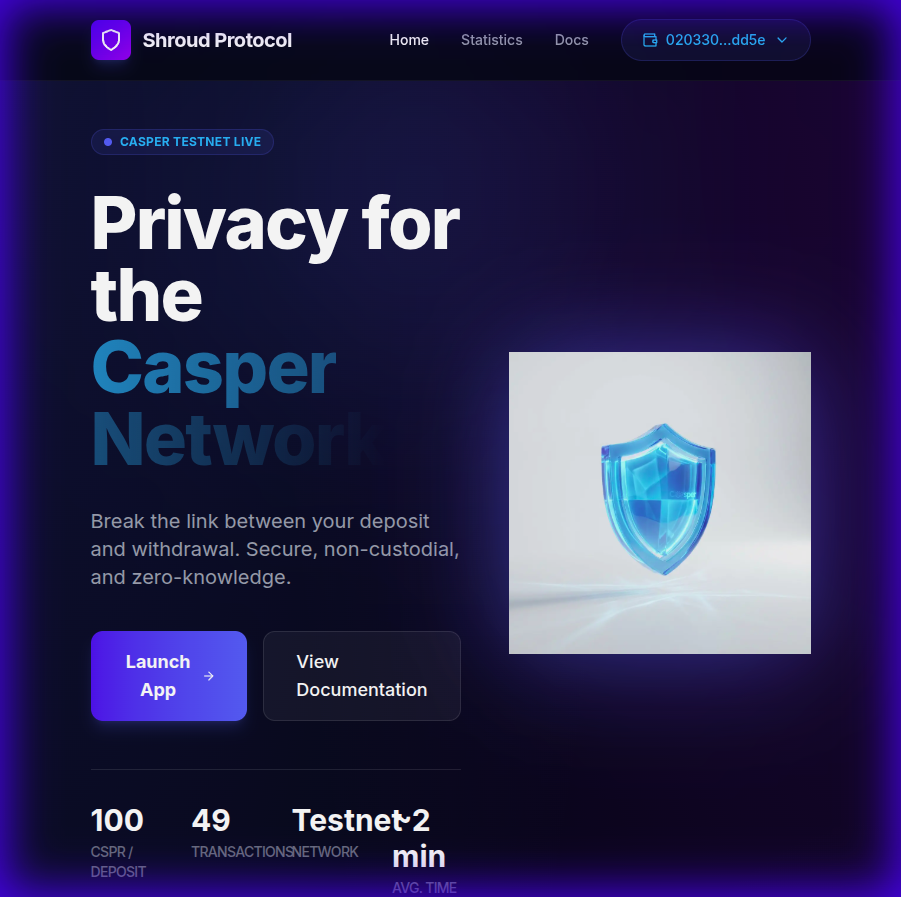
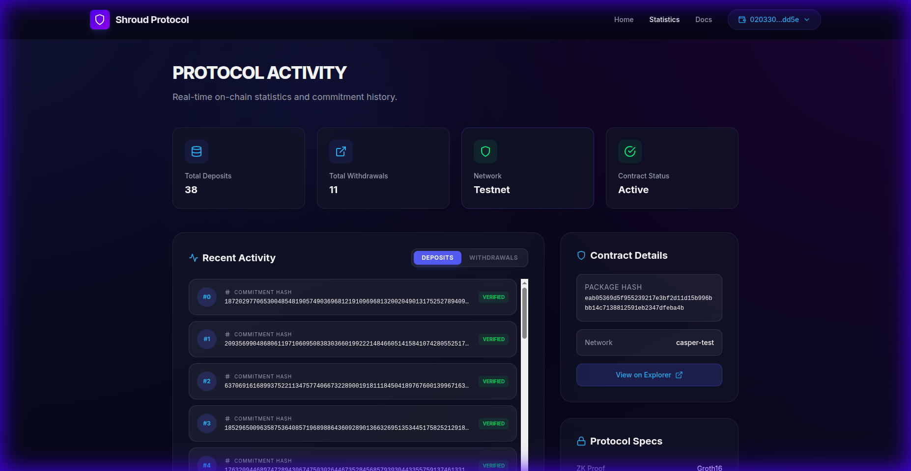

# Shroud Protocol

Shroud Protocol is a privacy-preserving mixer built on the Casper Network. It allows users to deposit CSPR into a smart contract and withdraw it later to a different address, effectively breaking the on-chain link between the depositor and the recipient. This is achieved using Zero-Knowledge Proofs (ZK-SNARKs) powered by Groth16 and MiMC hashing.

## 🌟 Features

- **Privacy**: Uses ZK-SNARKs (Groth16) to prove ownership of funds without revealing the deposit source.
- **Security**: Implements the MiMC7 hash function for efficient and secure in-circuit hashing.
- **Robust Sync**: Features "On-Chain First" synchronization, pulling live data directly from the Casper blockchain and Explorer API for both CLI and Frontend.
- **Automatic Backups**: Downloads a JSON secret key automatically after every deposit for maximum safety.
- **Live Monitoring**: Real-time transaction feeds and global activity tracking on-chain.
- **Non-Custodial**: Users maintain full control of their funds via a secret key.
- **User-Friendly**: Modern Web App with a "Cosmic" dark theme and a dedicated CLI.
- **Developer-Ready**: Built with the Odra framework and optimized for Casper SDK v5.

## 🔒 How It Works

### 1. Deposit (The "Locking" Phase)
When you deposit CSPR, the protocol generates a digital "secret note" for you.
- **Secret Generation**: Your browser generates two random numbers: a `secret` and a `nullifier`.
- **Commitment**: These two numbers are hashed together to create a **Commitment**. Think of this as a sealed envelope containing your secret.
- **On-Chain Transaction**: You send the Commitment and funds to the smart contract. The contract adds your commitment to a Merkle Tree but never sees your secret.
- **User Action**: You receive a **Secret Key**. 
    - **New**: The app automatically downloads this as a JSON file (`shroud-secret-*.json`) as soon as the transaction is submitted.

### 2. Withdraw (The "Unlocking" Phase)
When you want to withdraw, you use your Secret Key to prove you own one of the deposits without revealing which one.
- **Proof Generation**: You paste your Secret Key and enter a Recipient Address. The frontend uses `snarkjs` to generate a Zero-Knowledge Proof.
- **ZK-SNARK**: This proof mathematically demonstrates that you know a secret/nullifier pair for a valid commitment in the Merkle Tree, without revealing which one.
- **Nullifier**: The proof includes a Nullifier Hash to prevent double-spending.
- **On-Chain Verification**: The smart contract verifies the proof and sends funds to the recipient, breaking the link between depositor and recipient.

## 🖼️ User Interface
 
The frontend features a **Premium Dark Theme** designed for a modern, immersive experience:
 
- **Cosmic Aesthetic**: Deep black backgrounds with rich blue/purple mesh gradients.
- **Glassmorphism**: Translucent cards and panels with subtle glowing borders.
- **Interactive Elements**: Animated buttons, glowing text, and smooth transitions.
 



## 🏗️ Architecture

The protocol consists of three main components:

```mermaid
graph TD
    User[User] -->|Deposit| Frontend
    User -->|Withdraw| Frontend
    Frontend -->|Interacts| Contract[Smart Contract (Odra)]
    Frontend -->|Generates Proof| Circuits[ZK Circuits (Circom)]
    Contract -->|Verifies Proof| Verifier[Groth16 Verifier]
    Contract -->|Manages| MerkleTree[Merkle Tree]
```

- **Smart Contracts (`contracts/`)**: Written in Rust using the Odra framework. Handles deposits, manages the Merkle Tree state, and verifies ZK proofs to authorize withdrawals.
- **Circuits (`circuits/`)**: Written in Circom. Defines the constraints for the ZK proof, ensuring that the user knows the secret corresponding to a valid leaf in the Merkle Tree.
- **Frontend (`frontend/`)**: A Next.js web application featuring a **Premium Dark Theme** with a "Cosmic" aesthetic. It manages the user's wallet connection, generates secrets, computes ZK proofs in the browser using `snarkjs`, and submits transactions.
- **CLI (`cli/`)**: A TypeScript-based command-line tool for automated interactions and testing.

## 📂 Project Structure

- `contracts/`: Rust smart contracts (Odra).
- `circuits/`: Circom circuits and trusted setup scripts.
- `cli/`: TypeScript CLI for interacting with the protocol.
- `frontend/`: Next.js web interface.
- `scripts/`: Automation scripts for building, testing, and setup.
- `docs/`: Detailed developer documentation.

## Getting Started

### 📦 Dependencies

We provide a script to install all necessary dependencies (Rust, Odra, Casper Client, npm packages).

1.  **Run the installation script**:
    ```bash
    ./scripts/install_dependencies.sh
    ```

**Manual Installation Details:**

| Tool | Version | Purpose |
| :--- | :--- | :--- |
| **Node.js** | v18+ | Runtime for CLI and Frontend |
| **Rust** | nightly | Language for Smart Contracts |
| **Cargo Odra** | 2.4.0+ | Framework for Casper Contracts |
| **Casper Client**| 5.0.0+ | Tool for interacting with Casper Network |
| **Circom** | v2.0+ | Compiler for ZK Circuits |
| **SnarkJS** | v0.7.0+ | ZK Proof generation and verification |

### Latest Deployment (Casper Testnet)
- **Contract Package Hash**: `contract-package-eab05369d5f955239217e3bf2d11d15b996bbb14c7138812591eb2347dfeba4b`
- **Contract Hash**: `hash-eab05369d5f955239217e3bf2d11d15b996bbb14c7138812591eb2347dfeba4b`

### 🚀 Quick Start (Automated)

We provide scripts to automate the build and setup process.

1.  **Build Everything**:
    ```bash
    ./scripts/build_all.sh
    ```
2.  **Run Tests**:
    ```bash
    ./scripts/test_all.sh
    ```
3.  **Setup Circuits (Trusted Setup)**:
    ```bash
    ./scripts/setup_circuits.sh
    ```

### 🛠️ Manual Installation

If you prefer to install components manually:

1.  **Clone the repository**:
    ```bash
    git clone https://github.com/yourusername/shroud-protocol.git
    cd shroud-protocol
    ```

2.  **Install Dependencies**:
    ```bash
    # CLI
    cd cli && npm install && cd ..
    
    # Frontend
    cd frontend && npm install && cd ..
    ```

## 📖 Usage

#### 1. Frontend (Recommended)

The easiest way to use Shroud Protocol is via the web interface.

**Prerequisites:**
- Install the [Casper Wallet Extension](https://www.casperwallet.io/).
- Create a wallet and fund it with CSPR (Testnet).

**Steps:**
1.  **Start the App**:
    ```bash
    cd frontend
    npm install
    npm run dev
    ```
2.  **Connect Wallet**:
    - Open `http://localhost:3000`.
    - Click **"Connect Wallet"** in the top right.
    - Approve the connection in the popup.
3.  **Deposit**:
    - Go to the **Deposit** tab and ensure your wallet is connected.
    - Click **"Deposit 100 CSPR"**.
    - Sign the transaction in your wallet.
    - **AUTOMATIC BACKUP**: The secret key will be displayed on screen AND automatically downloaded to your computer as a JSON file. Keep it safe!
4.  **Withdraw**:
    - Go to the **Withdraw** tab.
    - Paste your **Secret Key JSON** or copy the values into the text area.
    - Enter the **Recipient Address** (or click the wallet address to copy yours if needed).
    - Click **"Withdraw"**.
    - The protocol will compute the ZK proof and authorize the release of funds to the fresh address.
5.  **Monitor Activity**:
    - Visit the **Statistics** page to see the global feed of deposits and withdrawals in real-time.

#### 2. CLI (Advanced)

For developers or automated scripts.

See [USAGE.md](./USAGE.md) for detailed scenarios and examples.

**Setup:**
```bash
cd cli
npm install
npm run build
```

**Commands:**

*   **Deposit**:
    ```bash
    # Generates a secret, saves it to output, and deposits 100 CSPR
    npm start -- deposit \
      --node https://node.testnet.casper.network \
      --contract <CONTRACT_HASH> \
      --key ./path/to/secret_key.pem \
      --output ./my_secret.json \
      --session ../contracts/wasm/deposit_session.wasm
    ```
    > **Note**: The `--session` flag is required for real CSPR transfers.

*   **Withdraw**:
    ```bash
    # Uses the secret to generate a proof and withdraw to a recipient
    npm start -- withdraw \
      --node https://node.testnet.casper.network \
      --contract <CONTRACT_HASH> \
      --secrets ./my_secret.json \
      --recipient <RECIPIENT_PUBLIC_KEY_HEX> \
      --wasm ../circuits/withdraw_js/withdraw.wasm \
      --zkey ../circuits/withdraw_final.zkey \
      --key ./path/to/payer_key.pem
    ```

## License

MIT
