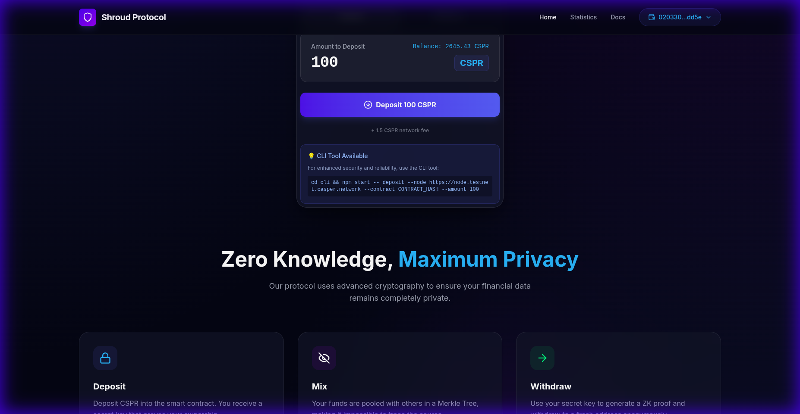

# Shroud Protocol Usage Guide

This guide provides detailed scenarios and examples for using the Shroud Protocol, including the recently verified CLI privacy flow.

## 🌟 Scenario 1: The Basic Privacy Flow (Alice & Bob)

**Goal**: Alice wants to send 100 CSPR to Bob without anyone knowing she is the sender.

1.  **Alice Deposits**:
    -   Alice connects her wallet (Address A) to the Shroud Frontend.
    -   She navigates to the **Deposit** tab.
    
    -   She clicks "Deposit 100 CSPR".
    -   **AUTOMATIC BACKUP**: The app generates a **Secret Key** and instantly triggers a JSON file download (`shroud-secret-*.json`).
    -   Alice saves this file securely (though it's also shown on screen as a backup).
    -   The transaction is confirmed on-chain.

2.  **The Wait**:
    -   Alice waits for a few other users to deposit. This increases the "anonymity set". If she withdraws immediately, it's easier to guess the link.

3.  **Alice Withdraws (to Bob)**:
    -   Alice sends the **Secret Key** to Bob (off-chain, via a secure channel like Signal).
    -   **OR** Alice acts as the relayer herself.
    -   Let's assume Alice wants to withdraw to Bob's address (Address B).
    -   Alice (or Bob) opens the **Withdraw** tab.
    
    -   She enters the **Secret Key**.
    -   She enters **Bob's Address (Address B)** as the recipient.
    -   She clicks "Withdraw".
    -   The app generates a ZK Proof that says "I know a secret for *one* of the deposits, but I won't tell you which one."
    -   The contract verifies the proof and sends 100 CSPR to Address B.

**Result**: The blockchain shows Address A deposited, and Address B received funds. There is no on-chain link between A and B.

## 🛡️ Scenario 2: Recovering from a Lost Connection
**Goal**: You made a deposit, but your browser crashed or you deleted your local storage.

**Automatic Fix**:
- **Chronological Sync**: The protocol automatically fetches all your historical commitments from the blockchain upon page load, sorting them correctly by time.
- **Force Re-sync**: If your Merkle Tree ever seems out of sync, click the **"Force Re-sync from Explorer"** button in the Withdraw tab. This will rebuild your proof paths from scratch using fresh on-chain data.
- **Secret Recovery**: If you lost your JSON file but have the secret string (e.g. from an old screenshot), you can simply paste it back into the Withdraw tab.

**CRITICAL RISK**: 
- If you lose both the JSON file AND the secret string *and* did not write it down, your funds are **LOST FOREVER**. The secret is never stored on a server.

## 🔧 Scenario 3: CLI Automation for Power Users

**Goal**: You want to programmatically deposit funds every week.

1.  **Setup**:
    -   Ensure you have the CLI installed and built.
    -   Create a script `weekly_deposit.sh`:

    ```bash
    #!/bin/bash
    DATE=$(date +%F)
    SECRET_FILE="./secrets/deposit_$DATE.json"
    
    npm start -- deposit \
      --node https://node.testnet.casper.network \
      --contract eab05369d5f955239217e3bf2d11d15b996bbb14c7138812591eb2347dfeba4b \
      --key ./my_wallet_key.pem \
      --output $SECRET_FILE \
      --session ../contracts/wasm/deposit_session.wasm
      
    echo "Deposited! Secret saved to $SECRET_FILE"
    ```

2.  **Run**:
    -   Set up a cron job to run this script.

## 💎 Scenario 5: Verified CLI Privacy Flow (Live Examples)

**Goal**: Execute a complete privacy cycle using the Command Line Interface on Casper Testnet.

### 1. Deposit
```bash
npm start -- deposit \
  --node https://node.testnet.casper.network \
  --contract eab05369d5f955239217e3bf2d11d15b996bbb14c7138812591eb2347dfeba4b \
  --key ./Account1_secret_key.pem \
  --output ./my_secret.json \
  --session ../contracts/wasm/deposit_session.wasm
```
**Verified Deploy**: `124c0b7529e6bf01cbda6e6b83f3efcd21487b029b1a47593051edfcb36b180c`

### 2. Synchronize & Withdraw
The CLI automatically synchronizes with the blockchain to reconstruct the Merkle Tree.

```bash
npm start -- withdraw \
  --node https://node.testnet.casper.network \
  --contract eab05369d5f955239217e3bf2d11d15b996bbb14c7138812591eb2347dfeba4b \
  --secrets ./my_secret.json \
  --recipient 01396822d984b112f78314f919fec1ce4364de2c98c2077b68679ea93e41156aac \
  --wasm ../circuits/withdraw_js/withdraw.wasm \
  --zkey ../circuits/withdraw_final.zkey \
  --key ./Account1_secret_key.pem
```

**Terminal Output Highlights:**
```text
🌳 Reconstructing Merkle Tree...
   🔎 Syncing commitments from purse: uref-3c4011cbd1...
   📝 Found 37 on-chain commitments
   ✅ Synced with blockchain (index: 36)
⚡ Generating Zero-Knowledge Proof...
✅ Withdrawal submitted!
```
**Verified Deploy**: `b011a47dc2501ea37930bc7af59d0db7aeb03bf47edad85363f2cb1c0fb3c47e`

## ❌ Scenario 6: Double Spending Attempt

**Goal**: A malicious user tries to withdraw the same deposit twice.

1.  **First Withdrawal**:
    -   The user withdraws successfully using their Secret Key.
    -   The contract records the `nullifier_hash` (derived from the secret) as "spent".

2.  **Second Withdrawal**:
    -   The user tries to use the same Secret Key again.
    -   They generate a valid ZK Proof (the math still works).
    -   They submit the transaction.
    -   **Contract Check**: The contract checks if `nullifier_hash` exists in the `nullifiers` mapping.
    -   **Result**: The transaction REVERTS with error `DoubleSpend`.

## 🔒 Privacy Best Practices

1.  **Fresh Addresses**: Always withdraw to a completely new address that has no history with your deposit address.
2.  **Time Delays**: Wait for multiple other deposits to occur between your deposit and withdrawal.
3.  **Standard Amounts**: The protocol uses fixed amounts (100 CSPR) to prevent amount-based correlation.
